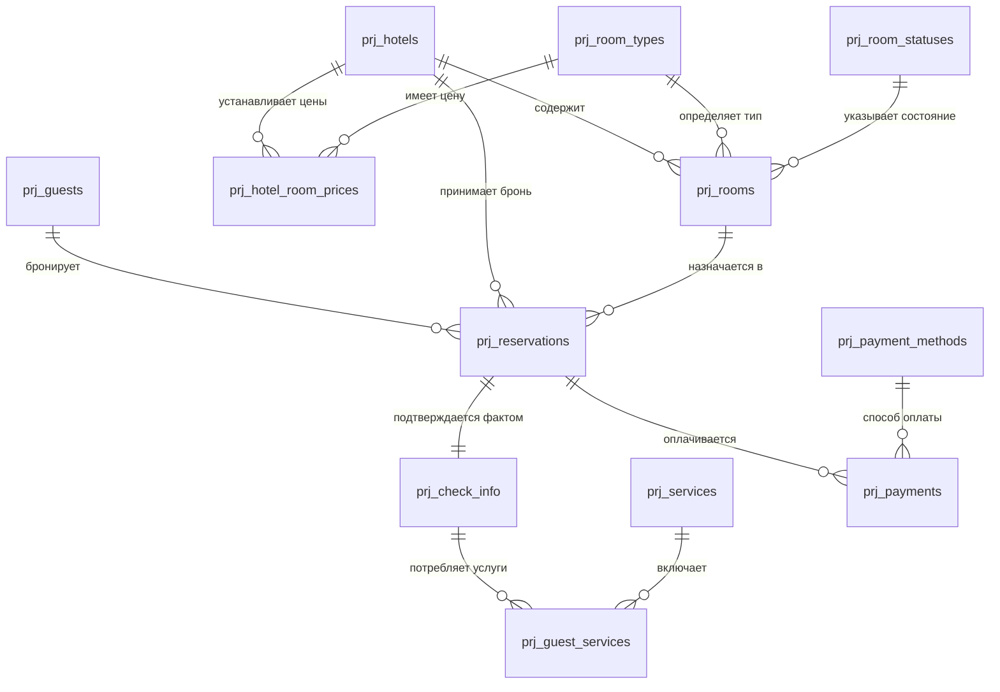

# 🏨 Управление бронированием услуг гостиницы

Проект представляет собой реляционную базу данных для автоматизации бизнес-процессов отеля: управление номерным фондом, бронирование, регистрация заездов, дополнительные услуги и финансовый учет.

---

## 📋 Описание таблиц БД

### Таблица prj_room_statuses (Статусы номеров)

| Поле | Тип данных | Описание |
| :--- | :--- | :--- |
| status_id | INT | PK. Идентификатор статуса |
| status_name | NVARCHAR(50) | Название (Свободен, Занят) |

### Таблица prj_payment_methods (Способы оплаты)

| Поле | Тип данных | Описание |
| :--- | :--- | :--- |
| payment_method_id | INT | PK. Идентификатор метода |
| method_name | NVARCHAR(50) | Название (Карта, Наличные) |

### Таблица prj_hotels (Отели)

| Поле | Тип данных | Описание |
| :--- | :--- | :--- |
| hotel_id | INT | PK. Идентификатор отеля |
| hotel_name | NVARCHAR(100) | Название |
| address | NVARCHAR(255) | Адрес |
| phone | NVARCHAR(20) | Телефон |
| email | NVARCHAR(100) | Электронная почта |
| stars | INT | Звездность (1-5) |
| total_rooms | INT | Всего номеров |
| location | GEOGRAPHY | Координаты |

### Таблица prj_room_types (Типы номеров)

| Поле | Тип данных | Описание |
| :--- | :--- | :--- |
| room_type_id | INT | PK. Identity |
| type_name | NVARCHAR(50) | Категория номера |
| capacity | INT | Вместимость (чел) |

### Таблица prj_hotel_room_prices (Цены)

| Поле | Тип данных | Описание |
| :--- | :--- | :--- |
| hotel_id | INT | PK, FK к prj_hotels |
| room_type_id | INT | PK, FK к prj_room_types |
| price | DECIMAL(10,2) | Стоимость |

### Таблица prj_rooms (Номера)

| Поле | Тип данных | Описание |
| :--- | :--- | :--- |
| room_id | INT | PK. Identity |
| hotel_id | INT | FK к отелям |
| room_type_id | INT | FK к типам номеров |
| room_number | NVARCHAR(10) | Номер комнаты |
| floor | INT | Этаж |
| status_id | INT | FK к статусам |

### Таблица prj_guests (Гости)

| Поле | Тип данных | Описание |
| :--- | :--- | :--- |
| guest_id | INT | PK. Identity |
| first_name | NVARCHAR(50) | Имя |
| last_name | NVARCHAR(50) | Фамилия |
| passport_number | NVARCHAR(20) | Паспорт (Unique) |
| phone | NVARCHAR(20) | Телефон |
| email | NVARCHAR(100) | Почта |

### Таблица prj_reservations (Бронирования)

| Поле | Тип данных | Описание |
| :--- | :--- | :--- |
| reservation_id | INT | PK. Identity |
| hotel_id | INT | FK к отелям |
| room_id | INT | FK к номерам |
| guest_id | INT | FK к гостям |
| check_in_plan | DATE | План заезда |
| check_out_plan | DATE | План выезда |
| reservation_date | DATETIME | Дата создания |

### Таблица prj_check_info (Заезд/Выезд)

| Поле | Тип данных | Описание |
| :--- | :--- | :--- |
| check_in_id | INT | PK. Identity |
| reservation_id | INT | FK к брони (Unique) |
| check_in_fact | DATETIME | Факт заезда |
| check_out_fact | DATETIME | Факт выезда |

### Таблица prj_services (Услуги)

| Поле | Тип данных | Описание |
| :--- | :--- | :--- |
| service_id | INT | PK. Identity |
| service_name | NVARCHAR(100) | Название услуги |
| service_price | DECIMAL(10,2) | Цена |

### Таблица prj_guest_services (Заказанные услуги)

| Поле | Тип данных | Описание |
| :--- | :--- | :--- |
| guest_service_id | INT | PK. Identity |
| check_in_id | INT | FK к факту проживания |
| service_id | INT | FK к справочнику услуг |
| service_date | DATETIME | Дата оказания |
| quantity | INT | Количество |

### Таблица prj_payments (Платежи)

| Поле | Тип данных | Описание |
| :--- | :--- | :--- |
| payment_id | INT | PK. Identity |
| reservation_id | INT | FK к бронированию |
| payment_date | DATETIME | Дата оплаты |
| amount | DECIMAL(10,2) | Сумма |
| payment_method_id| INT | FK к методам оплаты |

---

## 📊 Визуальная схема связей (ER-диаграмма)


---

## 🔍 Описание аналитических запросов

Ниже представлены 6 ключевых сценариев анализа данных с использованием оконных функций, сложных объединений и агрегации.

### 1. Анализ доходности отелей. 
**Цель:** посчитать общую выручку каждого отеля, количество бронирований и средний чек. Используется агрегация данных и Join.

<details>
<summary>💻 Посмотреть SQL запрос</summary>

```sql
SELECT 
    h.hotel_name AS 'Отель',
    COUNT(r.reservation_id) AS 'Всего бронирований',
    SUM(p.amount) AS 'Всего выручка',
    ROUND(AVG(p.amount), 2) AS 'Средний чек'
FROM prj_hotels h
    JOIN prj_reservations r ON h.hotel_id = r.hotel_id
    LEFT JOIN prj_payments p ON r.reservation_id = p.reservation_id
GROUP BY h.hotel_name
ORDER BY SUM(p.amount) DESC;
```

### 2. Популярность доп. услуг по категориям. 
**Цель:** сначала подготовить данные о продажах услуг, а затем объединить их с каталогом для финального анализа. В данном запросе используется CTE.

<details>
<summary>💻 Посмотреть SQL запрос</summary>

```sql
WITH ServiceStats AS (
    SELECT 
        gs.service_id, 
        SUM(gs.quantity) AS total_qty,
        --подсчет выручки
        SUM(gs.quantity * s.service_price) AS revenue_per_service
    FROM prj_guest_services gs
    --таблица с ценами
    JOIN prj_services s ON gs.service_id = s.service_id
    GROUP BY gs.service_id
)
SELECT 
    s.service_name AS 'Доп. услуга',
    ss.total_qty AS 'Кол.-во заказов услуги',
    ss.revenue_per_service AS 'Выручка по услуге'
FROM prj_services s
    JOIN ServiceStats ss ON s.service_id = ss.service_id
WHERE
    --возьмем только прибыльные услуги
    ss.revenue_per_service > 1000
ORDER BY ss.total_qty DESC;
```

### 3. Рейтинг самых прибыльных гостей.
**Цель:** Составить топ гостей по сумме всех их трат во всех отелях сети, запрос использует оконную функцию DENSE_RANK().

<details>
<summary>💻 Посмотреть SQL запрос</summary>

```sql
SELECT 
    g.first_name AS 'Имя', 
    g.last_name AS 'Фамилия',
    SUM(p.amount) AS 'Всего потрачено',
    --функция присваивает рейтинг по величине затраченной суммы, с большей суммой - рейтинг 1, и т.д.
    DENSE_RANK() OVER (ORDER BY SUM(p.amount) DESC) AS 'Рейтинг гостя'
FROM prj_guests g
    JOIN prj_reservations r ON g.guest_id = r.guest_id
    JOIN prj_payments p ON r.reservation_id = p.reservation_id
GROUP BY g.guest_id, g.first_name, g.last_name
ORDER BY 4 ASC;
```

### 4. Отчет по «плану-факту» проживания. 
**Цель:** выявить случаи, когда гости задерживались дольше запланированного ("оверстей") или уезжали раньше, что важно для планирования уборки и брони.

<details>
<summary>💻 Посмотреть SQL запрос</summary>

```sql
UPDATE prj_check_info
    SET [check_out_fact] = '2026-03-15'
WHERE
    [check_in_id] = 34;

--ситуация, когда клиент выезжает раньше запланированного
UPDATE prj_check_info
    SET [check_out_fact] = '2026-03-07'
WHERE
    [check_in_id] = 36;

--Запрос выявляет случаи, когда гости задерживались дольше запланированного или уезжали раньше, что важно для планирования уборки и брони.
SELECT
    g.last_name + ' ' + g.first_name AS 'Гость',
    r.check_in_plan AS 'Плановая дата заезда',
    r.check_out_plan AS 'Плановая дата выезда',
    ci.check_in_fact AS 'Фактическая дата заезда',
    ci.check_out_fact AS 'Фактическая дата выезда',
    DATEDIFF(day, r.check_in_plan, r.check_out_plan) AS 'Запланировано дней проживания',
    DATEDIFF(day, ci.check_in_fact, ci.check_out_fact) AS 'Фактически дней проживания',
    DATEDIFF(day, r.check_out_plan, ci.check_out_fact) AS 'Разница в днях',
    IIF(DATEDIFF(day, r.check_out_plan, ci.check_out_fact) > 0, 
        'Клиент прожил дольше на ' + CAST(DATEDIFF(day, r.check_out_plan, ci.check_out_fact) AS NVARCHAR(3)) + ' дн.',
        'Клиент выехал раньше на ' + CAST(ABS(DATEDIFF(day, r.check_out_plan, ci.check_out_fact)) AS NVARCHAR(3)) + ' дн.')
    AS 'Статус'
FROM prj_reservations r
    JOIN prj_guests g ON r.guest_id = g.guest_id
    JOIN prj_check_info ci ON r.reservation_id = ci.reservation_id
WHERE
    ci.check_out_fact IS NOT NULL 
    AND r.check_out_plan <> CAST(ci.check_out_fact AS DATE);
```

### 5. Поиск самых востребованных типов номеров в каждом отеле.
**Цель:** расчет процента загрузки конкретного типа номера относительно общего количества броней в отеле.

<details>
<summary>💻 Посмотреть SQL запрос</summary>

```sql
SELECT 
    h.hotel_name AS 'Отель',
    rt.type_name AS 'Категория номера',
    COUNT(r.reservation_id) AS 'Кол.-во бронирований',
    (SELECT COUNT(*) FROM prj_reservations WHERE hotel_id = h.hotel_id) AS 'Общее кол.-во броней',
    ROUND(CAST(COUNT(r.reservation_id) AS FLOAT) / 
        (SELECT COUNT(*) FROM prj_reservations WHERE hotel_id = h.hotel_id) * 100, 2) AS '% загрузки'
FROM prj_hotels h
    JOIN prj_rooms rm ON h.hotel_id = rm.hotel_id
    JOIN prj_room_types rt ON rm.room_type_id = rt.room_type_id
    JOIN prj_reservations r ON rm.room_id = r.room_id
GROUP BY h.hotel_id, h.hotel_name, rt.type_name
ORDER BY 'Отель', 'Кол.-во бронирований' DESC;
```

### 6. Сверка задолженностей.
**Цель:** найти бронирования, по которым сумма оказанных услуг и стоимость проживания превышают фактически внесенные платежи. Используется Having и математический расчет.

<details>
<summary>💻 Посмотреть SQL запрос</summary>

```sql
SELECT
    r.reservation_id,
    g.guest_id,
    g.last_name + ' ' + g.first_name AS 'Гость',
    hp.price AS 'Цена',
    DATEDIFF(day, r.check_in_plan, r.check_out_plan) AS 'План.проживание(дн.)',
    --стоимость номера
    (hp.price * DATEDIFF(day, r.check_in_plan, r.check_out_plan)) AS 'План.стоимость номера',
    SUM(gs.quantity) AS 'Кол.-во оказ. услуг',
    ISNULL(SUM(gs.quantity * s.service_price), 0) AS 'Стоимость оказ.услуг',
    ISNULL(p.total_paid, 0) AS 'Всего оплачено',
    ((hp.price * DATEDIFF(day, r.check_in_plan, r.check_out_plan)) + ISNULL(SUM(gs.quantity * s.service_price), 0)) - ISNULL(p.total_paid, 0) AS 'Задолженность'
FROM prj_reservations r
    JOIN prj_guests g ON r.guest_id = g.guest_id
    LEFT JOIN prj_rooms room ON r.room_id = room.room_id
    JOIN prj_hotel_room_prices hp ON r.hotel_id = hp.hotel_id AND room.room_type_id = hp.room_type_id
    LEFT JOIN prj_check_info ci ON r.reservation_id = ci.reservation_id
    LEFT JOIN prj_guest_services gs ON ci.check_in_id = gs.check_in_id
    LEFT JOIN prj_services s ON gs.service_id = s.service_id
    LEFT JOIN 
        (SELECT reservation_id, SUM(amount) AS total_paid FROM prj_payments GROUP BY reservation_id) p 
        ON r.reservation_id = p.reservation_id
GROUP BY r.reservation_id, g.guest_id, g.last_name, g.first_name, hp.price, r.check_in_plan, r.check_out_plan, p.total_paid
--Having тут служит для проверки условия по агрегированным данным: что сумма плановой стоимости номера+стоимость оказанных услуг > фактически оплаченной суммы гостя
HAVING ((hp.price * DATEDIFF(day, r.check_in_plan, r.check_out_plan)) + ISNULL(SUM(gs.quantity * s.service_price), 0)) > ISNULL(p.total_paid, 0);
```

### Оптимизированный вариант запроса 6 с использованием CTE без сложной группировки

<details>
<summary>💻 Посмотреть SQL запрос</summary>

```sql
--суммы по услугам
WITH ServiceTotals AS (
    SELECT 
        ci.reservation_id,
        SUM(gs.quantity) AS total_qty,
        SUM(gs.quantity * s.service_price) AS total_service_price
    FROM prj_check_info ci
    JOIN prj_guest_services gs ON ci.check_in_id = gs.check_in_id
    JOIN prj_services s ON gs.service_id = s.service_id
    GROUP BY ci.reservation_id
),
--платежи
PaymentTotals AS (
    SELECT 
        reservation_id, 
        SUM(amount) AS total_paid 
    FROM prj_payments 
    GROUP BY reservation_id
)
--теперь в основном запросе не обязательно использовать Having
SELECT
    r.reservation_id,
    g.guest_id,
    g.last_name + ' ' + g.first_name AS 'Гость',
    hp.price AS 'Цена',
    DATEDIFF(day, r.check_in_plan, r.check_out_plan) AS 'План.проживание(дн.)',
    (hp.price * DATEDIFF(day, r.check_in_plan, r.check_out_plan)) AS 'План.стоимость номера',
    ISNULL(st.total_qty, 0) AS 'Кол.-во оказ. услуг',
    ISNULL(st.total_service_price, 0) AS 'Стоимость оказ.услуг',
    ISNULL(pt.total_paid, 0) AS 'Всего оплачено',
    ((hp.price * DATEDIFF(day, r.check_in_plan, r.check_out_plan)) + ISNULL(st.total_service_price, 0)) - ISNULL(pt.total_paid, 0) AS 'Задолженность'
FROM prj_reservations r
    JOIN prj_guests g ON r.guest_id = g.guest_id
    LEFT JOIN prj_rooms room ON r.room_id = room.room_id
    JOIN prj_hotel_room_prices hp ON r.hotel_id = hp.hotel_id AND room.room_type_id = hp.room_type_id
    LEFT JOIN ServiceTotals st ON r.reservation_id = st.reservation_id
    LEFT JOIN PaymentTotals pt ON r.reservation_id = pt.reservation_id
WHERE 
    ((hp.price * DATEDIFF(day, r.check_in_plan, r.check_out_plan)) + ISNULL(st.total_service_price, 0)) > ISNULL(pt.total_paid, 0)
ORDER BY 'Задолженность' DESC;

--7. ABC-анализ доп. услуг. A-самые прибыльные услуги, B-услуги со средней доходностью, C-не приносят денег
WITH ServiceRevenue AS (
    SELECT 
        s.service_name,
        SUM(gs.quantity * s.service_price) AS revenue,
        SUM(SUM(gs.quantity * s.service_price)) OVER() AS total_rev
    FROM prj_guest_services gs
    JOIN prj_services s ON gs.service_id = s.service_id
    GROUP BY s.service_name
),
RunningTotal AS (
    SELECT 
        service_name,
        revenue,
        SUM(revenue) OVER(ORDER BY revenue DESC) / total_rev * 100 AS cumulative_pct
    FROM ServiceRevenue
)
SELECT *,
    CASE 
        WHEN cumulative_pct <= 80 THEN 'A'
        WHEN cumulative_pct <= 95 THEN 'B'
        ELSE 'C'
    END AS abc_category
FROM RunningTotal;
```

---
