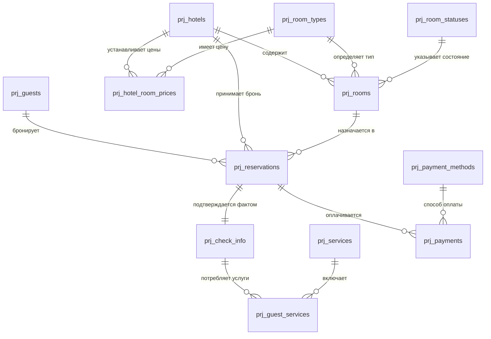

# 🏨 Управление бронированием услуг гостиницы

Проект представляет собой реляционную базу данных для автоматизации бизнес-процессов отеля: управление номерным фондом, бронирование, регистрация заездов, дополнительные услуги и финансовый учет.

---

## 📋 Описание таблиц БД

### Таблица prj_room_statuses (Статусы номеров)

| Поле | Тип данных | Описание |
| :--- | :--- | :--- |
| status_id | INT | PK. Идентификатор статуса |
| status_name | NVARCHAR(50) | Название (Свободен, Занят) |

### Таблица prj_payment_methods (Способы оплаты)

| Поле | Тип данных | Описание |
| :--- | :--- | :--- |
| payment_method_id | INT | PK. Идентификатор метода |
| method_name | NVARCHAR(50) | Название (Карта, Наличные) |

### Таблица prj_hotels (Отели)

| Поле | Тип данных | Описание |
| :--- | :--- | :--- |
| hotel_id | INT | PK. Идентификатор отеля |
| hotel_name | NVARCHAR(100) | Название |
| address | NVARCHAR(255) | Адрес |
| phone | NVARCHAR(20) | Телефон |
| email | NVARCHAR(100) | Электронная почта |
| stars | INT | Звездность (1-5) |
| total_rooms | INT | Всего номеров |
| location | GEOGRAPHY | Координаты |

### Таблица prj_room_types (Типы номеров)

| Поле | Тип данных | Описание |
| :--- | :--- | :--- |
| room_type_id | INT | PK. Identity |
| type_name | NVARCHAR(50) | Категория номера |
| capacity | INT | Вместимость (чел) |

### Таблица prj_hotel_room_prices (Цены)

| Поле | Тип данных | Описание |
| :--- | :--- | :--- |
| hotel_id | INT | PK, FK к prj_hotels |
| room_type_id | INT | PK, FK к prj_room_types |
| price | DECIMAL(10,2) | Стоимость |

### Таблица prj_rooms (Номера)

| Поле | Тип данных | Описание |
| :--- | :--- | :--- |
| room_id | INT | PK. Identity |
| hotel_id | INT | FK к отелям |
| room_type_id | INT | FK к типам номеров |
| room_number | NVARCHAR(10) | Номер комнаты |
| floor | INT | Этаж |
| status_id | INT | FK к статусам |

### Таблица prj_guests (Гости)

| Поле | Тип данных | Описание |
| :--- | :--- | :--- |
| guest_id | INT | PK. Identity |
| first_name | NVARCHAR(50) | Имя |
| last_name | NVARCHAR(50) | Фамилия |
| passport_number | NVARCHAR(20) | Паспорт (Unique) |
| phone | NVARCHAR(20) | Телефон |
| email | NVARCHAR(100) | Почта |

### Таблица prj_reservations (Бронирования)

| Поле | Тип данных | Описание |
| :--- | :--- | :--- |
| reservation_id | INT | PK. Identity |
| hotel_id | INT | FK к отелям |
| room_id | INT | FK к номерам |
| guest_id | INT | FK к гостям |
| check_in_plan | DATE | План заезда |
| check_out_plan | DATE | План выезда |
| reservation_date | DATETIME | Дата создания |

### Таблица prj_check_info (Заезд/Выезд)

| Поле | Тип данных | Описание |
| :--- | :--- | :--- |
| check_in_id | INT | PK. Identity |
| reservation_id | INT | FK к брони (Unique) |
| check_in_fact | DATETIME | Факт заезда |
| check_out_fact | DATETIME | Факт выезда |

### Таблица prj_services (Услуги)

| Поле | Тип данных | Описание |
| :--- | :--- | :--- |
| service_id | INT | PK. Identity |
| service_name | NVARCHAR(100) | Название услуги |
| service_price | DECIMAL(10,2) | Цена |

### Таблица prj_guest_services (Заказанные услуги)

| Поле | Тип данных | Описание |
| :--- | :--- | :--- |
| guest_service_id | INT | PK. Identity |
| check_in_id | INT | FK к факту проживания |
| service_id | INT | FK к справочнику услуг |
| service_date | DATETIME | Дата оказания |
| quantity | INT | Количество |

### Таблица prj_payments (Платежи)

| Поле | Тип данных | Описание |
| :--- | :--- | :--- |
| payment_id | INT | PK. Identity |
| reservation_id | INT | FK к бронированию |
| payment_date | DATETIME | Дата оплаты |
| amount | DECIMAL(10,2) | Сумма |
| payment_method_id| INT | FK к методам оплаты |

---

## 📊 Визуальная схема связей (ER-диаграмма)


---

## 🔍 Описание аналитических запросов

Ниже представлены 6 ключевых сценариев анализа данных с использованием оконных функций, сложных объединений и агрегации.

### 1. Анализ доходности отелей. 
**Цель:** посчитать общую выручку каждого отеля, количество бронирований и средний чек. Используется агрегация данных и Join.

<details>
<summary>💻 Посмотреть SQL запрос</summary>

```sql
SELECT 
    h.hotel_name AS 'Отель',
    COUNT(r.reservation_id) AS 'Всего бронирований',
    SUM(p.amount) AS 'Всего выручка',
    ROUND(AVG(p.amount), 2) AS 'Средний чек'
FROM prj_hotels h
    JOIN prj_reservations r ON h.hotel_id = r.hotel_id
    LEFT JOIN prj_payments p ON r.reservation_id = p.reservation_id
GROUP BY h.hotel_name
ORDER BY SUM(p.amount) DESC;
```
</details>

### 2. Популярность доп. услуг по категориям. 
**Цель:** сначала подготовить данные о продажах услуг, а затем объединить их с каталогом для финального анализа. В данном запросе используется CTE.

<details>
<summary>💻 Посмотреть SQL запрос</summary>

```sql
WITH ServiceStats AS (
    SELECT 
        gs.service_id, 
        SUM(gs.quantity) AS total_qty,
        --подсчет выручки
        SUM(gs.quantity * s.service_price) AS revenue_per_service
    FROM prj_guest_services gs
    --таблица с ценами
    JOIN prj_services s ON gs.service_id = s.service_id
    GROUP BY gs.service_id
)
SELECT 
    s.service_name AS 'Доп. услуга',
    ss.total_qty AS 'Кол.-во заказов услуги',
    ss.revenue_per_service AS 'Выручка по услуге'
FROM prj_services s
    JOIN ServiceStats ss ON s.service_id = ss.service_id
WHERE
    --возьмем только прибыльные услуги
    ss.revenue_per_service > 1000
ORDER BY ss.total_qty DESC;
```
</details>

### 3. Рейтинг самых прибыльных гостей.
**Цель:** Составить топ гостей по сумме всех их трат во всех отелях сети, запрос использует оконную функцию DENSE_RANK().

<details>
<summary>💻 Посмотреть SQL запрос</summary>

```sql
SELECT 
    g.first_name AS 'Имя', 
    g.last_name AS 'Фамилия',
    SUM(p.amount) AS 'Всего потрачено',
    --функция присваивает рейтинг по величине затраченной суммы, с большей суммой - рейтинг 1, и т.д.
    DENSE_RANK() OVER (ORDER BY SUM(p.amount) DESC) AS 'Рейтинг гостя'
FROM prj_guests g
    JOIN prj_reservations r ON g.guest_id = r.guest_id
    JOIN prj_payments p ON r.reservation_id = p.reservation_id
GROUP BY g.guest_id, g.first_name, g.last_name
ORDER BY 4 ASC;
```
</details>

### 4. Отчет по «плану-факту» проживания. 
**Цель:** выявить случаи, когда гости задерживались дольше запланированного ("оверстей") или уезжали раньше, что важно для планирования уборки и брони.

<details>
<summary>💻 Посмотреть SQL запрос</summary>

```sql
UPDATE prj_check_info
    SET [check_out_fact] = '2026-03-15'
WHERE
    [check_in_id] = 34;

--ситуация, когда клиент выезжает раньше запланированного
UPDATE prj_check_info
    SET [check_out_fact] = '2026-03-07'
WHERE
    [check_in_id] = 36;

--Запрос выявляет случаи, когда гости задерживались дольше запланированного или уезжали раньше, что важно для планирования уборки и брони.
SELECT
    g.last_name + ' ' + g.first_name AS 'Гость',
    r.check_in_plan AS 'Плановая дата заезда',
    r.check_out_plan AS 'Плановая дата выезда',
    ci.check_in_fact AS 'Фактическая дата заезда',
    ci.check_out_fact AS 'Фактическая дата выезда',
    DATEDIFF(day, r.check_in_plan, r.check_out_plan) AS 'Запланировано дней проживания',
    DATEDIFF(day, ci.check_in_fact, ci.check_out_fact) AS 'Фактически дней проживания',
    DATEDIFF(day, r.check_out_plan, ci.check_out_fact) AS 'Разница в днях',
    IIF(DATEDIFF(day, r.check_out_plan, ci.check_out_fact) > 0, 
        'Клиент прожил дольше на ' + CAST(DATEDIFF(day, r.check_out_plan, ci.check_out_fact) AS NVARCHAR(3)) + ' дн.',
        'Клиент выехал раньше на ' + CAST(ABS(DATEDIFF(day, r.check_out_plan, ci.check_out_fact)) AS NVARCHAR(3)) + ' дн.')
    AS 'Статус'
FROM prj_reservations r
    JOIN prj_guests g ON r.guest_id = g.guest_id
    JOIN prj_check_info ci ON r.reservation_id = ci.reservation_id
WHERE
    ci.check_out_fact IS NOT NULL 
    AND r.check_out_plan <> CAST(ci.check_out_fact AS DATE);
```
</details>

### 5. Поиск самых востребованных типов номеров в каждом отеле.
**Цель:** расчет процента загрузки конкретного типа номера относительно общего количества броней в отеле.

<details>
<summary>💻 Посмотреть SQL запрос</summary>

```sql
SELECT 
    h.hotel_name AS 'Отель',
    rt.type_name AS 'Категория номера',
    COUNT(r.reservation_id) AS 'Кол.-во бронирований',
    (SELECT COUNT(*) FROM prj_reservations WHERE hotel_id = h.hotel_id) AS 'Общее кол.-во броней',
    ROUND(CAST(COUNT(r.reservation_id) AS FLOAT) / 
        (SELECT COUNT(*) FROM prj_reservations WHERE hotel_id = h.hotel_id) * 100, 2) AS '% загрузки'
FROM prj_hotels h
    JOIN prj_rooms rm ON h.hotel_id = rm.hotel_id
    JOIN prj_room_types rt ON rm.room_type_id = rt.room_type_id
    JOIN prj_reservations r ON rm.room_id = r.room_id
GROUP BY h.hotel_id, h.hotel_name, rt.type_name
ORDER BY 'Отель', 'Кол.-во бронирований' DESC;
```
</details>

### 6. Сверка задолженностей.
**Цель:** найти бронирования, по которым сумма оказанных услуг и стоимость проживания превышают фактически внесенные платежи. Используется Having и математический расчет.

<details>
<summary>💻 Посмотреть SQL запрос</summary>

```sql
SELECT
    r.reservation_id,
    g.guest_id,
    g.last_name + ' ' + g.first_name AS 'Гость',
    hp.price AS 'Цена',
    DATEDIFF(day, r.check_in_plan, r.check_out_plan) AS 'План.проживание(дн.)',
    --стоимость номера
    (hp.price * DATEDIFF(day, r.check_in_plan, r.check_out_plan)) AS 'План.стоимость номера',
    SUM(gs.quantity) AS 'Кол.-во оказ. услуг',
    ISNULL(SUM(gs.quantity * s.service_price), 0) AS 'Стоимость оказ.услуг',
    ISNULL(p.total_paid, 0) AS 'Всего оплачено',
    ((hp.price * DATEDIFF(day, r.check_in_plan, r.check_out_plan)) + ISNULL(SUM(gs.quantity * s.service_price), 0)) - ISNULL(p.total_paid, 0) AS 'Задолженность'
FROM prj_reservations r
    JOIN prj_guests g ON r.guest_id = g.guest_id
    LEFT JOIN prj_rooms room ON r.room_id = room.room_id
    JOIN prj_hotel_room_prices hp ON r.hotel_id = hp.hotel_id AND room.room_type_id = hp.room_type_id
    LEFT JOIN prj_check_info ci ON r.reservation_id = ci.reservation_id
    LEFT JOIN prj_guest_services gs ON ci.check_in_id = gs.check_in_id
    LEFT JOIN prj_services s ON gs.service_id = s.service_id
    LEFT JOIN 
        (SELECT reservation_id, SUM(amount) AS total_paid FROM prj_payments GROUP BY reservation_id) p 
        ON r.reservation_id = p.reservation_id
GROUP BY r.reservation_id, g.guest_id, g.last_name, g.first_name, hp.price, r.check_in_plan, r.check_out_plan, p.total_paid
--Having тут служит для проверки условия по агрегированным данным: что сумма плановой стоимости номера+стоимость оказанных услуг > фактически оплаченной суммы гостя
HAVING ((hp.price * DATEDIFF(day, r.check_in_plan, r.check_out_plan)) + ISNULL(SUM(gs.quantity * s.service_price), 0)) > ISNULL(p.total_paid, 0);
```
</details>

### Оптимизированный вариант запроса 6 с использованием CTE без сложной группировки

<details>
<summary>💻 Посмотреть SQL запрос</summary>

```sql
--суммы по услугам
WITH ServiceTotals AS (
    SELECT 
        ci.reservation_id,
        SUM(gs.quantity) AS total_qty,
        SUM(gs.quantity * s.service_price) AS total_service_price
    FROM prj_check_info ci
    JOIN prj_guest_services gs ON ci.check_in_id = gs.check_in_id
    JOIN prj_services s ON gs.service_id = s.service_id
    GROUP BY ci.reservation_id
),
--платежи
PaymentTotals AS (
    SELECT 
        reservation_id, 
        SUM(amount) AS total_paid 
    FROM prj_payments 
    GROUP BY reservation_id
)
--теперь в основном запросе не обязательно использовать Having
SELECT
    r.reservation_id,
    g.guest_id,
    g.last_name + ' ' + g.first_name AS 'Гость',
    hp.price AS 'Цена',
    DATEDIFF(day, r.check_in_plan, r.check_out_plan) AS 'План.проживание(дн.)',
    (hp.price * DATEDIFF(day, r.check_in_plan, r.check_out_plan)) AS 'План.стоимость номера',
    ISNULL(st.total_qty, 0) AS 'Кол.-во оказ. услуг',
    ISNULL(st.total_service_price, 0) AS 'Стоимость оказ.услуг',
    ISNULL(pt.total_paid, 0) AS 'Всего оплачено',
    ((hp.price * DATEDIFF(day, r.check_in_plan, r.check_out_plan)) + ISNULL(st.total_service_price, 0)) - ISNULL(pt.total_paid, 0) AS 'Задолженность'
FROM prj_reservations r
    JOIN prj_guests g ON r.guest_id = g.guest_id
    LEFT JOIN prj_rooms room ON r.room_id = room.room_id
    JOIN prj_hotel_room_prices hp ON r.hotel_id = hp.hotel_id AND room.room_type_id = hp.room_type_id
    LEFT JOIN ServiceTotals st ON r.reservation_id = st.reservation_id
    LEFT JOIN PaymentTotals pt ON r.reservation_id = pt.reservation_id
WHERE 
    ((hp.price * DATEDIFF(day, r.check_in_plan, r.check_out_plan)) + ISNULL(st.total_service_price, 0)) > ISNULL(pt.total_paid, 0)
ORDER BY 'Задолженность' DESC;

--7. ABC-анализ доп. услуг. A-самые прибыльные услуги, B-услуги со средней доходностью, C-не приносят денег
WITH ServiceRevenue AS (
    SELECT 
        s.service_name,
        SUM(gs.quantity * s.service_price) AS revenue,
        SUM(SUM(gs.quantity * s.service_price)) OVER() AS total_rev
    FROM prj_guest_services gs
    JOIN prj_services s ON gs.service_id = s.service_id
    GROUP BY s.service_name
),
RunningTotal AS (
    SELECT 
        service_name,
        revenue,
        SUM(revenue) OVER(ORDER BY revenue DESC) / total_rev * 100 AS cumulative_pct
    FROM ServiceRevenue
)
SELECT *,
    CASE 
        WHEN cumulative_pct <= 80 THEN 'A'
        WHEN cumulative_pct <= 95 THEN 'B'
        ELSE 'C'
    END AS abc_category
FROM RunningTotal;
```
</details>

---

## 📝 Описание представлений

### 1. Список услуг по гостиницам в разрезе гостей. 
**Описание:** Название **prj_guest_services_by_hotel**. Может применяться в отчётах по доп. услугам, детализация чеков гостей и т.д.  

<details>
<summary>💻 Посмотреть SQL запрос</summary>

```sql
CREATE VIEW prj_guest_services_by_hotel
AS
SELECT
    h.hotel_id,
    h.hotel_name,
    g.guest_id,
    CONCAT(g.last_name, ' ', g.first_name) AS guest_name,
    s.service_name,
    gs.service_date,
    gs.quantity,
    s.service_price,
    gs.quantity * s.service_price AS total_amount
FROM prj_guest_services gs
    JOIN prj_check_info ci ON gs.check_in_id = ci.check_in_id
    JOIN prj_reservations r ON ci.reservation_id = r.reservation_id
    JOIN prj_hotels h ON r.hotel_id = h.hotel_id
    JOIN prj_guests g ON r.guest_id = g.guest_id
    JOIN prj_services s ON gs.service_id = s.service_id;
```
</details>

### 2. Агрегированные услуги по гостю и гостинице. 
**Описание:** Название **prj_guest_service_summary**. Сумма услуг одного гостя в одной гостинице. Реализовано с CTE. Применение: анализ популярности услуг.  

<details>
<summary>💻 Посмотреть SQL запрос</summary>  
    
```sql
GO
CREATE VIEW prj_guest_service_summary
AS
WITH ServiceCTE AS (
    SELECT
        h.hotel_id,
        h.hotel_name,
        g.guest_id,
        CONCAT(g.last_name, ' ', g.first_name) AS guest_name,
        s.service_name,
        gs.quantity * s.service_price AS service_amount
    FROM prj_guest_services gs
    JOIN prj_check_info ci ON gs.check_in_id = ci.check_in_id
    JOIN prj_reservations r ON ci.reservation_id = r.reservation_id
    JOIN prj_hotels h ON r.hotel_id = h.hotel_id
    JOIN prj_guests g ON r.guest_id = g.guest_id
    JOIN prj_services s ON gs.service_id = s.service_id
)
SELECT
    hotel_name,
    guest_name,
    service_name,
    SUM(service_amount) AS total_service_amount
FROM ServiceCTE
GROUP BY hotel_name, guest_name, service_name;
```
</details>

### 3. Доля услуг в общем чеке гостя. 
**Описание:** Название **prj_guest_service_share**. Может применяться для анализа структуры расходов гостя, персональных предложений, маркетинговой аналитики. Используются оконные функции SUM() OVER (). 

<details>
<summary>💻 Посмотреть SQL запрос</summary>  
    
```sql
GO
CREATE VIEW prj_guest_service_share
AS
WITH TotalPerGuest AS (
    SELECT
        g.guest_id,
        CONCAT(g.last_name, ' ', g.first_name) AS guest_name,
        h.hotel_name,
        s.service_name,
        gs.quantity * s.service_price AS service_amount,
        SUM(gs.quantity * s.service_price) OVER (
            PARTITION BY g.guest_id, h.hotel_id
        ) AS total_guest_services
    FROM prj_guest_services gs
    JOIN prj_check_info ci ON gs.check_in_id = ci.check_in_id
    JOIN prj_reservations r ON ci.reservation_id = r.reservation_id
    JOIN prj_hotels h ON r.hotel_id = h.hotel_id
    JOIN prj_guests g ON r.guest_id = g.guest_id
    JOIN prj_services s ON gs.service_id = s.service_id
)
SELECT
    hotel_name,
    guest_name,
    service_name,
    service_amount,
    total_guest_services,
    CAST(service_amount * 100.0 / total_guest_services AS DECIMAL(5,2)) AS service_share_percent
FROM TotalPerGuest;
```
</details>

### 4. ТОП-3 услуги по каждой гостинице. 
**Описание:** Название **prj_top_services_by_hotel**. Применение: KPI гостиницы, оптимизация сервиса, отчёты руководству. Используется оконные функции RANK() OVER (). 

<details>
<summary>💻 Посмотреть SQL запрос</summary>  
    
```sql
GO
CREATE VIEW prj_top_services_by_hotel
AS
WITH ServiceRank AS (
    SELECT
        h.hotel_name,
        s.service_name,
        SUM(gs.quantity * s.service_price) AS revenue,
        RANK() OVER (
            PARTITION BY h.hotel_id
            ORDER BY SUM(gs.quantity * s.service_price) DESC
        ) AS service_rank
    FROM prj_guest_services gs
    JOIN prj_check_info ci ON gs.check_in_id = ci.check_in_id
    JOIN prj_reservations r ON ci.reservation_id = r.reservation_id
    JOIN prj_hotels h ON r.hotel_id = h.hotel_id
    JOIN prj_services s ON gs.service_id = s.service_id
    GROUP BY h.hotel_id, h.hotel_name, s.service_name
)
SELECT *
FROM ServiceRank
WHERE service_rank <= 3;
```
</details>

### 5. Средний чек услуг на гостя в гостинице. 
**Описание:** Название **prj_avg_service_check_by_hotel**. Используется CTE.   

<details>
<summary>💻 Посмотреть SQL запрос</summary>  
    
```sql
GO
CREATE VIEW prj_avg_service_check_by_hotel
AS
WITH GuestTotals AS (
    SELECT
        h.hotel_name,
        g.guest_id,
        SUM(gs.quantity * s.service_price) AS guest_service_total
    FROM prj_guest_services gs
    JOIN prj_check_info ci ON gs.check_in_id = ci.check_in_id
    JOIN prj_reservations r ON ci.reservation_id = r.reservation_id
    JOIN prj_hotels h ON r.hotel_id = h.hotel_id
    JOIN prj_guests g ON r.guest_id = g.guest_id
    JOIN prj_services s ON gs.service_id = s.service_id
    GROUP BY h.hotel_name, g.guest_id
)
SELECT
    hotel_name,
    AVG(guest_service_total) AS avg_service_check
FROM GuestTotals
GROUP BY hotel_name;
```
</details>

### 6. Источник данных для отчета по гео-аналитике. 
**Описание:** Название **prj_Hotel_KPIs**. Используется CTE.   

<details>
<summary>💻 Посмотреть SQL запрос</summary>  
    
```sql
GO
CREATE VIEW prj_Hotel_KPIs AS
WITH HotelKPIs AS (
    SELECT 
        h.hotel_id,
        h.hotel_name,
        --преобразование GEOGRAPHY в читаемые координаты
        h.location.Lat AS Latitude,
        h.location.Long AS Longitude,
        h.total_rooms,
        --доход (размер пузырька)
        SUM(p.amount) AS TotalRevenue,
        --загрузка (цвет пузырька)
        CAST(COUNT(DISTINCT ci.check_in_id) * 100.0 / (h.total_rooms * 30) AS DECIMAL(10,2)) AS OccupancyRate
    FROM prj_hotels h
    LEFT JOIN prj_reservations r ON h.hotel_id = r.hotel_id
    LEFT JOIN prj_check_info ci ON r.reservation_id = ci.reservation_id
    LEFT JOIN prj_payments p ON r.reservation_id = p.reservation_id
    --фильтр за последний месяц
    WHERE r.check_in_plan >= DATEADD(month, -1, GETDATE())
    GROUP BY h.hotel_id, h.hotel_name, h.location.Lat, h.location.Long, h.total_rooms
)
SELECT * FROM HotelKPIs;
```
</details>

---

## ⚙️ Хранимые процедуры  
В рамках проекта создано 2 хранимых процедуры, являющихся источниками данных для отчетов.

### 1. Хранимая процедура sp_Hotel_Analytics. 
**Описание:** Процедура является источником данных для отчета **"Комплексный Анализ доходности и эффективности (RevPAR)"**.  
Она предназначена для глубокого анализа эффективности работы отелей. Она рассчитывает финансовые показатели и ключевые метрики гостиничного бизнеса (KPI) за произвольный период.  

Основные задачи:  
•	**Консолидация доходов**: Расчет выручки раздельно по проживанию (номера) и дополнительным услугам.  
•	**Расчет KPI**: Вычисление важнейших отраслевых метрик — ADR и RevPAR.  
•	**Анализ лояльности**: Автоматическое определение самого ценного гостя для каждого отеля.  

#### Входные параметры  
Процедура `sp_Hotel_Analytics` принимает три необязательных параметра. Если параметры не переданы, отчет формируется за текущий календарный год по всем отелям.

| Параметр | Тип данных | Значение по умолчанию | Описание |
| :--- | :--- | :--- | :--- |
| **@StartDate** | `DATE` | `01.01.[Текущий_год]` | Начальная дата периода анализа. |
| **@EndDate** | `DATE` | `31.12.[Текущий_год]` | Конечная дата периода анализа. |
| **@HotelID** | `NVARCHAR(50)` | `NULL` | Идентификатор отеля для фильтрации. Если `NULL`, анализируются все отели. |


#### Выходные данные  
•	**Общая финансовая статистика**: Доход от номеров, доход от услуг и суммарная выручка.  
•	**Операционные данные**: Общее количество завершенных броней и суммарное количество проданных ночей.  
•	**ADR (Average Daily Rate)**: Средняя цена за одну ночь (показывает среднюю доходность проданного номера).  
•	**RevPAR (Revenue Per Available Room)**: Доход на один доступный номер (учитывает и цену, и общую заполняемость отеля).  
•	**Лояльность**: ФИО гостя, совершившего максимальное количество бронирований за всё время в данном отеле.  
 
<details>
<summary>💻 Посмотреть SQL-код процедуры</summary>  

```sql
ALTER PROCEDURE sp_Hotel_Analytics
    @StartDate DATE = NULL,
    @EndDate DATE = NULL,
    @HotelID NVARCHAR(50) = NULL
AS
-- DECLARE @StartDate DATE = NULL;
-- DECLARE @EndDate DATE = NULL;
-- DECLARE @HotelID NVARCHAR(50) = '1,2,3';

BEGIN
    SET NOCOUNT ON;

    --если даты не указаны, то текущий год
    SET @StartDate = ISNULL(@StartDate, DATEFROMPARTS(YEAR(GETDATE()), 1, 1));
    SET @EndDate = ISNULL(@EndDate, DATEFROMPARTS(YEAR(GETDATE()), 12, 31));

    WITH RoomRevenue AS (
        --доход от проживания (через платежи, привязанные к брони), должен брать только те платежи, что попали в период
        SELECT 
            r.hotel_id,
            r.reservation_id,
            SUM(p.amount) as total_paid
        FROM prj_reservations r
            JOIN prj_payments p ON r.reservation_id = p.reservation_id
        WHERE p.payment_date BETWEEN @StartDate AND @EndDate
        GROUP BY r.hotel_id, r.reservation_id
    ),
    ServiceRevenue AS (
        --доход от доп. услуг, тоже за период
        SELECT 
            res.hotel_id,
            SUM(gs.quantity * s.service_price) as service_total
        FROM prj_guest_services gs
            JOIN prj_services s ON gs.service_id = s.service_id
            JOIN prj_check_info ci ON gs.check_in_id = ci.check_in_id
            JOIN prj_reservations res ON ci.reservation_id = res.reservation_id
        WHERE gs.service_date BETWEEN @StartDate AND @EndDate
        GROUP BY res.hotel_id
    ),
    Occupancy AS (
        --количество фактически завершенных броней и ночей
        SELECT 
            r.hotel_id,
            COUNT(ci.reservation_id) as total_stays,
            SUM(DATEDIFF(day, ci.check_in_fact, ci.check_out_fact)) as total_nights
        FROM prj_reservations r
            JOIN prj_check_info ci ON r.reservation_id = ci.reservation_id
        WHERE ci.check_in_fact >= @StartDate AND ci.check_out_fact <= @EndDate
        GROUP BY hotel_id
    )
    
    SELECT 
        h.hotel_name AS 'Отель',
        h.stars AS 'Звезд',
        occ.total_stays AS 'Кол.-во бронирований',
        occ.total_nights AS 'Продано ночей',
        
        --платежи, доходность
        ISNULL(rev.total_room_income, 0) AS 'Доход от номеров',
        ISNULL(srv.service_total, 0) AS 'Доход от услуг',
        ISNULL(rev.total_room_income, 0) + ISNULL(srv.service_total, 0) AS 'Общая выручка',
        
        --KPI (Key Performance Indicators) - Ключевые показатели эффективности
        CASE 
            WHEN occ.total_nights > 0 THEN CAST(ISNULL(rev.total_room_income, 0) / occ.total_nights AS DECIMAL(10,2)) 
            ELSE 0
        --ADR (Average Daily Rate)
        END AS 'ADR (Средняя цена за ночь)',
        
        --эффективность использования фонда: RevPAR (Revenue Per Available Room) - доход на один доступный номер, учитывает и цену, и заполняемость
        --RevPAR = Общая выручка от номеров / Общее кол-во доступных номеров в периоде
        CAST((ISNULL(rev.total_room_income, 0) / (h.total_rooms * DATEDIFF(day, @StartDate, DATEADD(day, 1, @EndDate)))) AS DECIMAL(10,2)) AS 'RevPAR',

        --лучший гость
        (SELECT TOP 1 g.last_name + ' ' + g.first_name 
         FROM prj_guests g
            JOIN prj_reservations r ON g.guest_id = r.guest_id
         WHERE r.hotel_id = h.hotel_id
         GROUP BY g.guest_id, g.last_name, g.first_name
         ORDER BY COUNT(r.reservation_id) DESC) AS 'Самый лояльный гость'

    FROM prj_hotels h
        LEFT JOIN (SELECT hotel_id, SUM(total_paid) as total_room_income FROM RoomRevenue GROUP BY hotel_id) rev ON h.hotel_id = rev.hotel_id
        LEFT JOIN ServiceRevenue srv ON h.hotel_id = srv.hotel_id
        LEFT JOIN Occupancy occ ON h.hotel_id = occ.hotel_id
    WHERE (@HotelID IS NULL OR h.hotel_id = @HotelID)
    ORDER BY 'Общая выручка' DESC;
END;

EXEC sp_Hotel_Analytics --'20260101', '20261231', 1
```
</details>

---

## 📈 Описание отчетов
В рамках проекта создано 3 отчета. Средством разработки отчетов является Power BI Desktop. 

### 1. Оплаты услуг по гостиницам в разрезе гостей. 
**Описание отчета:** Отчет создан на основе представления **prj_guest_services_by_hotel**.  
В отчете создана мера с общей суммой оплаты по отелю, созданы фильтры по отелю, гостю и услуге, а также выводятся 2 диаграммы, позволяющие просматривать сумму оплаты по датам, а также сумму оплаты в разрезе услуг.  
С помощью фильтров можно выбирать отель, гостя и услугу, графики динамически меняются, предоставляя информацию по требуемым параметрам.  


На второй странице отчета размещена круговая диаграмма, показывающая долю услуги в общей выручке.  


---

### 2. Гео-аналитика. 
**Описание отчета:** Отчет создан на основе представления **prj_Hotel_KPIs**.  
Поскольку в таблице **prj_hotels** есть поле **location** с типом **GEOGRAPHY**, можно сделать визуализацию данных на карте: *размер «пузырька» отеля — это его доход, а цвет — процент загрузки*.  

Далее в Power BI Desktop на визуализации «Карта» можно вывести эти «пузырьки», настроив их цвет и размер. Цель такого отчета - подсветить «аномалии»:  
•	**Большой красный пузырь**: Отель в прибыльном месте, приносит много денег, но работает «вполсилы» (низкая загрузка).  
•	**Маленький синий пузырь**: Отель забит под завязку, но денег мало. Скорее всего, цены неоправданно занижены.  


---

### 3. Комплексный Анализ доходности и эффективности. 
**Описание отчета:** Отчет создан на основе хранимой процедуры **sp_Hotel_Analytics**.  

Один из самых важных отчетов для гостиничного бизнеса — это «Комплексный анализ доходности и эффективности (RevPAR)». Он должен учитывать:  
•	**Финансовые показатели**: Выручка за проживание и выручка за доп. услуги.  
•	**Эффективность (RevPAR)**: Доход на один доступный номер.  
•	**Лояльность**: Лучший клиент отеля, кто из гостей потратил больше всего денег за всё время.  
•	**Операционная точность**: Сравнение плановых заездов с фактическим количеством проданных ночей.  
•	**Средняя цена за ночь**.  


---

### 4. Ведомость контроля бронирования и статуса прибытия гостей. 
**Описание отчета:** Отчет создан на основе хранимой процедуры **sp_GetBookedRoomsReport**.  

Отчет "на каждый день" — это «Ведомость контроля бронирования и статуса прибытия гостей». Он показывает:  
•	Информацию, сгруппированную по отелю, категории номера, гостю.  
•	Информацию о плановых и фактических датах заезда.  
•	Информацию о плановом количестве ночей, цене номера и плановой выручке.  
•	Самое важное - отчет подсвечивает статус бронирования. Если заезд клиента ожидается сегодня, подсвечивается зеленым. Если заезд просрочен, подсвечивается красным. Будущий резерв подсвечивается серым.   


---

## 📜 Запросы агрегации и сегментации данных  
**Сегментация данных в SQL** — процесс разделения всей массы записей на отдельные группы (сегменты) по определенным признакам для более глубокого анализа.  
В качестве примеров сегментации данных можно рассмотреть следующий SQL-запросы:

### 1. Разделение жильцов по сегментам "VIP", "Лояльный" и "Новичок".  

<details>
<summary>💻 Посмотреть SQL запрос</summary>

```sql
SELECT 
    g.last_name AS 'Фамилия', 
    g.first_name AS 'Имя',
    COUNT(r.reservation_id) AS 'Кол.-во проживаний',
    SUM(p.amount) AS 'Всего затрачено',
    CASE 
        WHEN COUNT(r.reservation_id) > 3 AND SUM(p.amount) > 100000 THEN 'VIP'
        WHEN COUNT(r.reservation_id) > 1 AND SUM(p.amount) BETWEEN 50000 AND 100000 THEN 'Лояльный'
        ELSE 'Новичок'
    END AS 'Сегмент'
FROM prj_guests g
    JOIN prj_reservations r ON g.guest_id = r.guest_id
    JOIN prj_payments p ON r.reservation_id = p.reservation_id
GROUP BY g.guest_id, g.last_name, g.first_name
ORDER BY 3 DESC;
```
</details>

### 2. Классический RFM-анализ (Давность-Частота-Деньги).
Классический RFM-анализ используется в качестве усложнения сегментирования из предыдущего запроса.  

<details>
<summary>💻 Посмотреть SQL запрос</summary>

```sql
SELECT 
    g.last_name AS 'Фамилия', 
    g.first_name AS 'Имя',
    --Recency (Давность) - от даты фактического заезда (check_in_fact)
    DATEDIFF(day, MAX(ci.check_in_fact), GETDATE()) AS 'Давность(дней)',
    --Frequency (Частота) - только те бронирования, по которым был реальный заезд
    COUNT(ci.check_in_id) AS 'Частота(визитов)',
    --Monetary (Деньги) - сумма платежей по факту проживания
    SUM(p.amount) AS 'Сумма',
    
    CASE 
        --клиент был недавно и часто посещает
        WHEN COUNT(ci.check_in_id) >= 2 AND DATEDIFF(day, MAX(ci.check_in_fact), GETDATE()) <= 30 THEN 'Активный лояльный'
        
        --был один раз и очень давно (фактически заехал, но не вернулся)
        WHEN COUNT(ci.check_in_id) = 1 AND DATEDIFF(day, MAX(ci.check_in_fact), GETDATE()) > 30 THEN 'Разовый (ушедший)'
        
        --много визитов, но последний был больше полугода назад
        WHEN COUNT(ci.check_in_id) >= 3 AND DATEDIFF(day, MAX(ci.check_in_fact), GETDATE()) > 180 THEN 'Спящий VIP'
        
        --оставил много денег за последний визит
        WHEN SUM(p.amount) > 40000 AND DATEDIFF(day, MAX(ci.check_in_fact), GETDATE()) <= 30 THEN 'Ценный гость'
        
        ELSE 'Прочие'
    END AS 'RFM-сегмент(факт.)'

FROM prj_guests g
    JOIN prj_reservations r ON g.guest_id = r.guest_id
    --INNER JOIN, чтобы исключить брони без заезда
    INNER JOIN prj_check_info ci ON r.reservation_id = ci.reservation_id
    JOIN prj_payments p ON r.reservation_id = p.reservation_id
GROUP BY g.guest_id, g.last_name, g.first_name
ORDER BY 3 ASC;
```
</details>

### 3. Анализ популярности и доходности услуг.  
Сегментирование дополнительных услуг, чтобы понять, какие из них приносят основной доход.  

<details>
<summary>💻 Посмотреть SQL запрос</summary>

```sql
SELECT 
    s.service_name AS 'Услуга',
    SUM(gs.quantity) AS 'Кол.-во заказов',
    SUM(gs.quantity * s.service_price) AS 'Выручка',
    CASE
        --если выручка по услуге > 20% от общей выручки - закон Парето: «20% видов услуг приносят 80% всей выручки»
        WHEN SUM(gs.quantity * s.service_price) > (SELECT SUM(quantity * service_price) * 0.2 FROM prj_guest_services JOIN prj_services ON prj_guest_services.service_id = prj_services.service_id) THEN 'Ключевой актив'
        ELSE 'Второстепенная услуга'
    END AS 'Категория'
FROM prj_services s
LEFT JOIN prj_guest_services gs ON s.service_id = gs.service_id
GROUP BY s.service_id, s.service_name;
```
</details>

### 4. Сегментация по загрузке отелей.  
Анализ того, насколько эффективно используются разные типы номеров в разных отелях.  

<details>
<summary>💻 Посмотреть SQL запрос</summary>

```sql
--переменная, чтобы подставить любой месяц
DECLARE @DaysInMonth INT = DAY(EOMONTH(GETDATE()));
WITH HotelCapacity AS (
    --сколько ночей может продать отель за @DaysInMonth дней
    SELECT 
        h.hotel_id,
        h.hotel_name,
        rt.room_type_id,
        rt.type_name,
        COUNT(r.room_id) AS total_rooms,
        --емкость за @DaysInMonth
        COUNT(r.room_id) * @DaysInMonth AS potential_nights
    FROM prj_hotels h
        JOIN prj_rooms r ON h.hotel_id = r.hotel_id
        JOIN prj_room_types rt ON r.room_type_id = rt.room_type_id
    GROUP BY h.hotel_id, h.hotel_name, rt.room_type_id, rt.type_name
),
ActualOccupancy AS (
    --сколько ночей было фактически прожито (из таблицы check_info)
    SELECT 
        r.hotel_id,
        room.room_type_id,
        SUM(DATEDIFF(day, ci.check_in_fact, ISNULL(ci.check_out_fact, GETDATE()))) AS actual_nights,
        AVG(p.price) AS avg_real_price
    FROM prj_reservations r
        JOIN prj_rooms room ON room.room_id = r.room_id
        JOIN prj_check_info ci ON r.reservation_id = ci.reservation_id
        JOIN prj_hotel_room_prices p ON r.hotel_id = p.hotel_id AND room.room_type_id = p.room_type_id
    --анализ за последние @DaysInMonth дней
    WHERE ci.check_in_fact >= DATEADD(day, -@DaysInMonth, GETDATE())
    GROUP BY r.hotel_id, room.room_type_id
)
SELECT 
    hc.hotel_name AS "Отель",
    hc.type_name AS "Категория номера",
    hc.total_rooms AS "Кол-во номеров",
    ISNULL(ao.actual_nights, 0) AS "Продано ночей",
    hc.potential_nights AS "Емкость за мес.",
    CAST(ISNULL(ao.actual_nights, 0) * 100.0 / hc.potential_nights AS DECIMAL(10,2)) AS "Загрузка %",
    CASE 
        WHEN (ISNULL(ao.actual_nights, 0) * 100.0 / hc.potential_nights) > 35 THEN 'Высокий спрос (Пора повышать цены)'
        WHEN (ISNULL(ao.actual_nights, 0) * 100.0 / hc.potential_nights) BETWEEN 30 AND 35 THEN 'Оптимально'
        WHEN (ISNULL(ao.actual_nights, 0) * 100.0 / hc.potential_nights) BETWEEN 10 AND 29 THEN 'Недозагрузка (Нужны акции)'
        ELSE 'Критический простой'
    END AS "Маркетинговая стратегия"
FROM HotelCapacity hc
    LEFT JOIN ActualOccupancy ao ON hc.hotel_id = ao.hotel_id AND hc.room_type_id = ao.room_type_id
ORDER BY 6 DESC;
```
</details>

---
